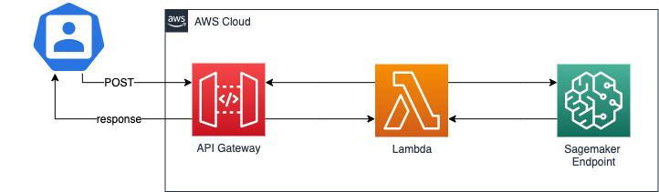

# Amazon UK product classification with NLP 

This project implements a Multinomial Naive Bayes to classify products on Its category based on user reviews.

It has one notebook called **amazonuk-product-classification_with-nlp**, that's show in an interactive way how to implements a scikit learn pipeline to apply Tf–idf in the selected columns and classify with Naive Bayes.

## Deplying in Amazon Sagemaker

This project also has a folder called *sagemaker* that has **host-model** notebook for AWS deployment over Sagemaker. To implement a custom algorithm (with the pipelines) with the Sagemaker, you have to use the SKLearn class (`from sagemaker.sklearn.estimator import SKLearn`). I put the required code in the *source* folder, split in a way that's SKLearn expect.

## API Gateway, Lambda and Serverless Framework

After training and deploying It, Sagemaker gives us an endpoint. To consume this endpoint externally, via a POST HTTP, I implement a Serverless Framework template (in the serverless folder) that creates a Lambda, triggered by the API Gateway POST, that's get a response from Sagemaker Endpoint, as shown below.

## Refs
- https://www.kaggle.com/baghern/a-deep-dive-into-sklearn-pipelines
- https://towardsdatascience.com/fine-tuning-xgboost-in-python-like-a-boss-b4543ed8b1e
- https://scikit-learn.org/stable/auto_examples/model_selection/plot_confusion_matrix.html
- https://towardsdatascience.com/machine-learning-nlp-text-classification-using-scikit-learn-python-and-nltk-c52b92a7c73a
